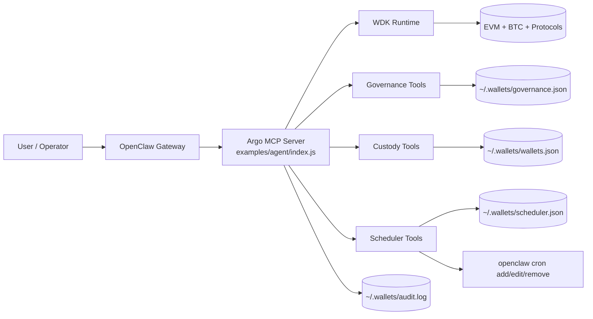
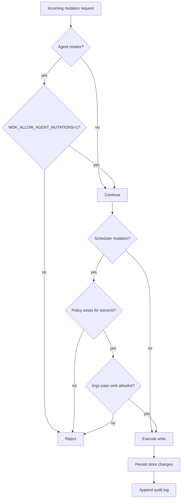
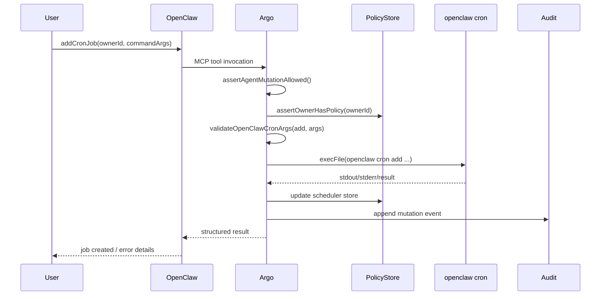

# Argo — Autonomous Wallet Operations on OpenClaw

## 1) What Argo is

Argo is an autonomous finance operations layer built on top of the WDK MCP Toolkit.

It turns wallet execution primitives (balance checks, swaps, bridge, lending, transfers) into a governed agent system that can:

- maintain encrypted wallet configuration metadata,
- evaluate goals against policy constraints,
- schedule and mutate recurring jobs via OpenClaw cron,
- and keep an auditable record of all successful mutations.

In short, Argo is **economic infrastructure for agentic execution**, not just a chat bot with wallet tools.

---

## 2) Why it exists

Most wallet-agent demos are either:

- too manual (human signs every action, no true autonomy), or
- too permissive (agent can do anything once connected).

Argo introduces a bounded autonomy model:

1. users define policy and goals,
2. the agent can act only inside that policy envelope,
3. high-risk mutation paths are gated and validated,
4. all writes are traceable.

---

## 3) What users can do with Argo

### Core economic actions

- Query wallet addresses and balances across chains.
- Fetch pricing and historical price data.
- Quote and execute swaps, bridges, and lending operations.
- Use optional fiat rails (MoonPay) where configured.

### Autonomous control actions

- Create/list wallet configs with encrypted key material handling.
- Set per-owner policy limits and protocol/operation restrictions.
- Create, edit, remove, and list OpenClaw cron jobs for recurring execution.
- Analyze goals against active policy to detect constraint violations.

---

## 4) User experience flow

### Step 1 — Connect Argo to OpenClaw

- Run setup (`npm run setup:openclaw`) to generate a local OpenClaw MCP snippet.
- Register Argo server (`examples/agent/index.js`) under OpenClaw MCP servers.

### Step 2 — Initialize governance

- Create/confirm owner policy using `setAgentPolicy`.
- Define goals with `upsertGoal`.

### Step 3 — Turn on automation

- Add recurring jobs with `addCronJob`.
- Iterate with `editCronJob` and `removeCronJob` as strategy changes.

### Step 4 — Operate with guardrails

- Agent mutations require explicit runtime enablement.
- Owner policy must exist before cron mutation is accepted.
- CLI arguments are validated against allowlists.

---

## 5) Architecture

### Components

- **OpenClaw Gateway**: orchestration + tool routing surface.
- **Argo MCP Server**: domain server exposing WDK + autonomous control tools.
- **WDK modules**: execution adapters for chains and protocols.
- **Local control store**: governance, custody metadata, scheduler metadata, audit.

---

## 6) Enforcement and safety model

Argo protects mutation paths with layered controls:

1. **Mutation gate**
   - Agent-initiated writes are blocked unless `WDK_ALLOW_AGENT_MUTATIONS=1`.

2. **Policy existence gate**
   - Scheduler mutation requires an existing policy record for `ownerId`.

3. **Argument validation gate**
   - Cron command args are validated by verb-specific allowlists (`add`, `edit`, `remove`).

4. **Audit logging**
   - Successful mutations append records to `~/.wallets/audit.log`.

5. **Encryption at rest (custody metadata)**
   - Sensitive wallet config fields are encrypted using `WDK_WALLET_ENCRYPTION_KEY`.

---

## 7) Runtime interaction sequence

---

## 8) Tooling surface in Argo

Argo bundles existing WDK economic tools with autonomous control layers:

- Wallet tools: address, balance, signing, transfers, fee quotes.
- Pricing tools: spot and historical market data.
- DeFi tools: swap, bridge, lending quote + execution.
- Optional indexer tools: transfer history and token balance indexing.
- Optional fiat tools: buy/sell quote + execution integrations.
- Custody tools: wallet config lifecycle with encrypted metadata handling.
- Governance tools: policy and goals lifecycle plus analysis.
- Scheduler tools: cron add/edit/remove/list backed by OpenClaw CLI.

---

## 9) Multi-tenant operating model

Argo is designed for per-user isolation by composition:

- Use per-user owner IDs and policy records.
- Route channel/session context to owner-scoped calls.
- Keep mutation authorization explicit (`WDK_ALLOW_AGENT_MUTATIONS`).
- Persist local owner-specific governance/scheduler state.
- Preserve auditable trails for all successful writes.

This gives each tenant independent policy envelopes while sharing a common MCP runtime footprint.

---

## 10) Why Argo qualifies as economic infrastructure

Argo is not just “AI plus wallet APIs.” It provides the control plane required for autonomous economic activity:

- **Policy** (what is allowed),
- **Goals** (what should happen),
- **Scheduler** (when it should happen),
- **Execution adapters** (how it happens),
- **Auditability** (what happened).

That stack is what makes autonomous financial agents dependable enough for production workflows.

---

## 11) Current implementation status

Implemented:

- OpenClaw-compatible MCP server entrypoint (`examples/agent/index.js`)
- canonical cron verb alignment (`add`, `edit`, `remove`) with compatibility aliases
- mutation + policy + CLI allowlist enforcement chain
- encrypted custody metadata and local stores
- README guidance for OpenClaw local integration

In progress / next:

- optional auto-merge support into `~/.openclaw/openclaw.json`
- richer policy simulation and pre-trade risk scoring
- managed signing service integration for stricter separation of duties

---

## 12) Quick start for judges and reviewers

1. Install project dependencies.
2. Run `npm run setup:openclaw`.
3. Merge generated snippet into `~/.openclaw/openclaw.json`.
4. Start OpenClaw and confirm Argo MCP server is loaded.
5. In a session:
   - call `setAgentPolicy`,
   - call `upsertGoal`,
   - call `addCronJob` and inspect audit trail in `~/.wallets/audit.log`.

This demonstrates end-to-end governed autonomy, not only wallet read/write primitives.
